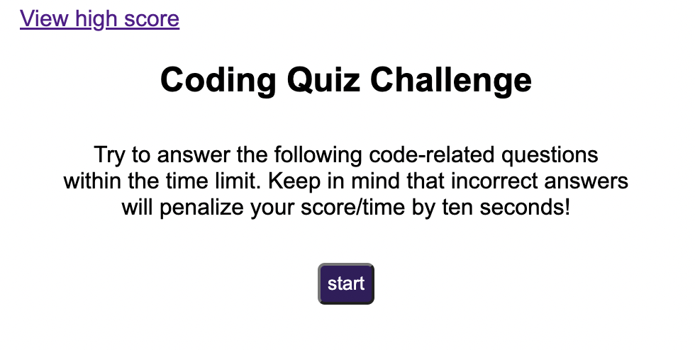
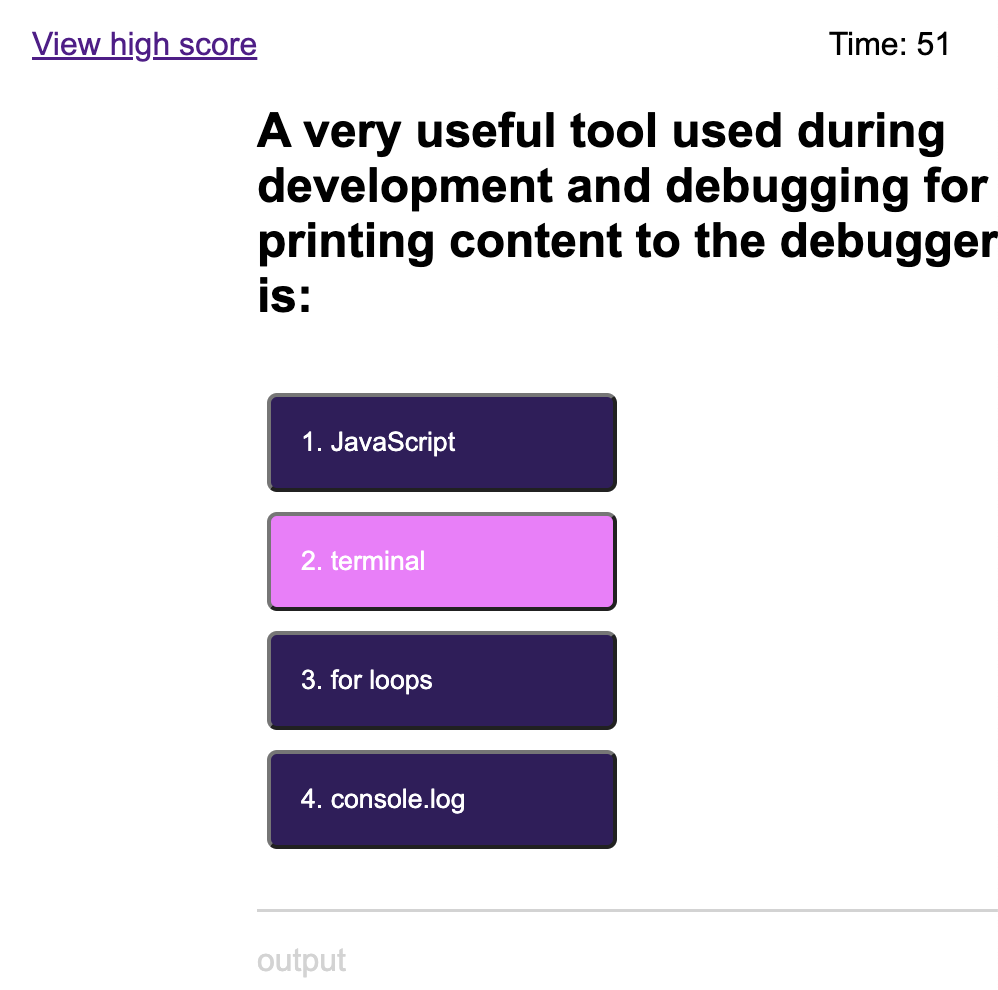
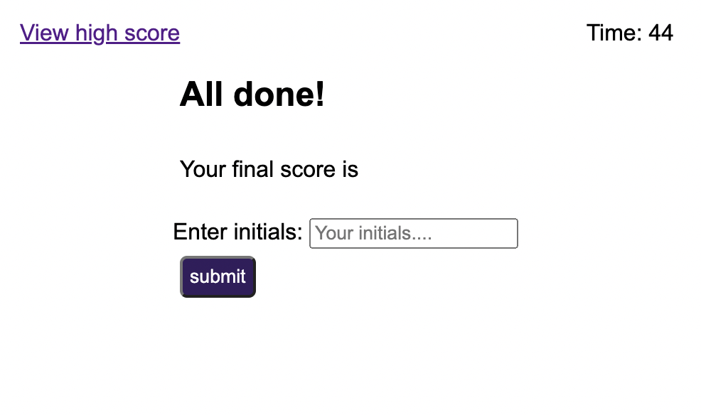
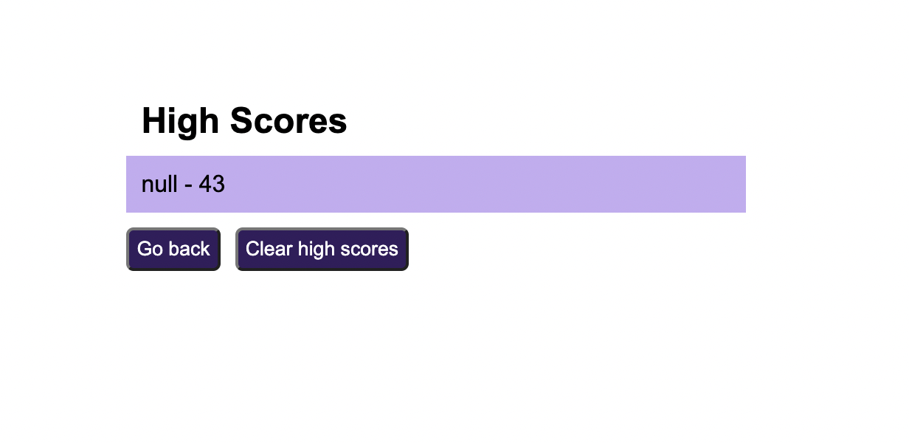

# Quiz-JavaScript
A website to assess the knowledge of JavaScript fundamentals

## Links to the webpage and repository

To access the website use [Quiz-JavaScript](haruka08.github.io/quiz-javascript/)

To access the GitHub repository use [GitHub Repository Quiz-JavaScript](https://github.com/Haruka08/Quiz-JavaScript)

## Content

The website consists of following 4 sections:

1. Start Page
    - This gives instructions on the upcomming series of quizes and the rules.
    - Once the user is ready, the start button starts the 60 second timer and the series of questions.

2. Quiz Page
    - Each page shows of a multiple answer question with a list of 4 possible answers.
    - When an incorrect answer is selected, the result is shown at the bottom of the list and the remaining time is deducted by 10 seconds.
    - when a correct answer is selected, the result is shown at the bottom of the list and it moves onto the next question,
    - There will be a series of 3 questions

3. Last Page
    - This shows a form to submit the user initial together with the score (remaining time) dispalyed.

4. High Score Page
    - When "View High Score" link located at he top left hand side of the page is clicked, it navigates to a new page displaying the score with a user initial with options to go back and to clear high score.
    - When "Go Back" button is clicked, it goes back to the main quiz page.
    When "Clear High Score" is clicked, it clears the user initial and the score displayed above.

## Screenshot of the modified website

